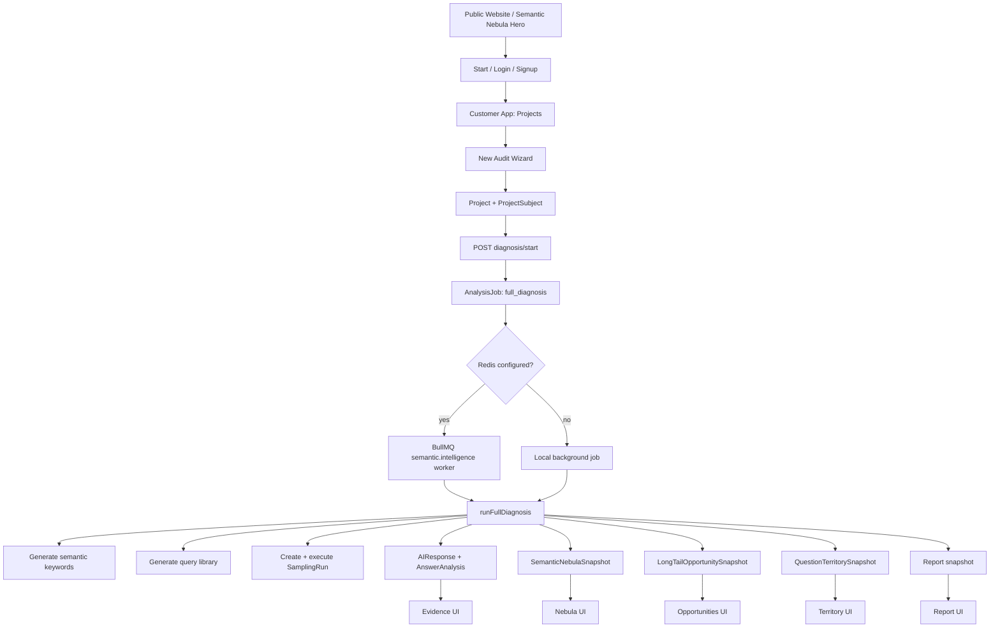
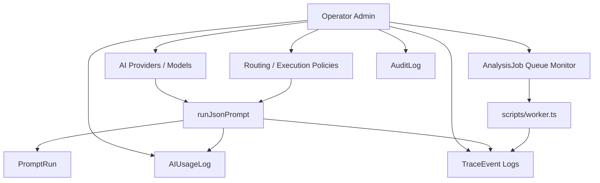
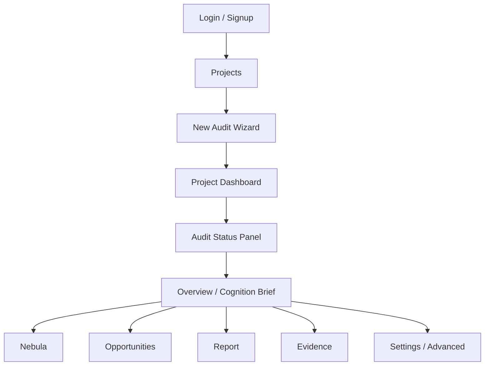

# CIP 项目全景快照与体验架构审计

日期：2026-05-21  
项目路径：`E:\Codes\AEO`  
审计对象：Public Website、Customer App、Operator Admin、后端诊断/探针/队列/AI 调用/日志链路  
审计方式：静态代码全景扫描、关键路由与核心服务阅读、本地入口连通性检查

---

## 1. Executive Summary

CIP 当前已经不是一个简单 SaaS 原型，而是一个能力密度很高的 AI Answer Space Intelligence Platform。项目已经具备多实体诊断、语义星云、语义引力、长尾机会、问题领地、AI Provider 抽象、Routing、Queue、Prompt Template、Trace Log、报告和运营后台等复杂能力。

真正的问题不是“后端功能少”，而是“用户前台的产品秩序还没有完全接住这些能力”。对普通客户来说，系统仍然容易显得像一个可视化后的后台：能看到很多状态、阶段、按钮、证据对象和指标，但不总是能立刻理解自己应该做什么。对运营方来说，后台功能齐全，但仍然偏表格和对象列表，缺少一个让非工程人员也能判断“系统健康、任务堵在哪、客户卡在哪”的运营指挥层。

最重要的判断：

1. Public Website 的首页已经朝“单屏星云视觉锚点”正确收敛，但首屏解释太少，存在“看起来高级但不知道发生了什么”的心理风险。
2. Customer App 已经从旧工作流改成 Overview / Nebula / Opportunities / Report / Evidence / Settings，但真实体验仍被反复出现的运行状态和技术对象打断。
3. 项目内同时存在新 locale 路由和旧 `(app)` 路由，说明产品 IA 正处于重构过渡期，维护和体验口径容易分裂。
4. Customer Nebula 页面仍是产品视觉最大短板：真实项目页里的星云可解释，但不够美，节点标签拥挤，和首页星云的震撼感不一致。
5. Evidence 体验还没有统一。不同页面各自展示一点证据，但没有形成跨 Nebula、Opportunity、Territory、Report、Trace 的统一证据抽屉。
6. Operator Admin 能覆盖 Provider、Routing、Queue、Usage、Trace、Audit，但页面还是“对象管理后台”，还不是“运营控制台”。
7. 后端架构的基础是扎实的，但高吞吐 Brand Probe 调度、local background diagnosis、queue worker、trace event 之间仍需要更明确的运行手册和失败恢复体验。

结论：CIP 的下一阶段不应继续堆更多功能，而应把已有能力重排成一条清晰的“AI 认知审计产品路径”。

---

## 2. 扫描范围

本次扫描覆盖了以下范围：

| 区域 | 规模/关键路径 | 说明 |
|---|---:|---|
| App Router 页面 | 约 105 个 `src/app` 文件 | locale 前台、客户后台、运营后台、API routes |
| Server/domain 层 | 约 88 个 `src/server` 文件 | AI、诊断、探针、星云、机会、队列、日志、权限、项目服务 |
| Components | 约 39 个 `src/components` 文件 | marketing、layout、diagnosis、admin、UI 组件 |
| Prisma migrations | 9 个迁移目录 | 已包含 semantic snapshots、brand probes、trace events 等 |
| 文档 | `docs/architecture/brand-only-coupling-map.md` | 现有架构文档很少，缺少全景产品体验文档 |

重点阅读文件包括：

- `src/app/[locale]/page.tsx`
- `src/components/marketing/public-nebula-hero.tsx`
- `src/components/marketing/demo-semantic-nebula-canvas.tsx`
- `src/components/layout/app-shell.tsx`
- `src/components/layout/project-page-shell.tsx`
- `src/components/layout/project-workflow-nav.tsx`
- `src/components/diagnosis/audit-status-panel.tsx`
- `src/app/[locale]/app/projects/page.tsx`
- `src/components/project/project-form.tsx`
- `src/app/[locale]/app/projects/[projectId]/dashboard/page.tsx`
- `src/app/[locale]/app/projects/[projectId]/semantic-nebula/page.tsx`
- `src/app/[locale]/app/projects/[projectId]/opportunities/page.tsx`
- `src/app/[locale]/app/projects/[projectId]/question-territory/page.tsx`
- `src/app/[locale]/app/projects/[projectId]/reports/page.tsx`
- `src/app/[locale]/app/projects/[projectId]/evidence/page.tsx`
- `src/app/[locale]/admin/page.tsx`
- `src/app/[locale]/admin/logs/page.tsx`
- `src/app/[locale]/admin/queues/page.tsx`
- `src/app/[locale]/admin/routing/page.tsx`
- `src/server/diagnosis/diagnosis-service.ts`
- `src/server/brand-probes/*`
- `src/server/semantic-nebula/*`
- `src/server/opportunity/*`
- `src/server/ai/json-executor.ts`
- `src/server/queue/client.ts`
- `scripts/worker.ts`
- `src/server/observability/*`

---

## 3. 当前产品架构全景

### 3.1 三个可见产品面

CIP 当前面向三类入口：

1. Public Website  
   面向未登录访客，用于建立产品第一印象。当前主要入口是 `/:locale`，首页已收敛为全屏 Semantic Nebula Showcase。

2. Customer App  
   面向客户，核心路径是创建审计项目、启动诊断、查看认知简报、星云、机会、报告和证据。当前入口是 `/:locale/app/projects`。

3. Operator Admin  
   面向平台运营方，管理用户、组织、项目、AI Provider、Models、Prompt、Queues、Routing、Trace Logs、Usage、Audit Logs、System Health。当前入口是 `/:locale/admin`。

### 3.2 当前核心后端能力

后端已经具备以下关键能力：

- Session-based auth：`src/server/auth/session.ts`
- Organization / role access：`src/server/auth/organizations.ts`, `src/server/auth/roles.ts`
- Project / ProjectSubject：`src/server/projects/*`, `src/server/data/projects.ts`
- Strict JSON executor：`src/server/ai/json-executor.ts`
- Provider registry / routing / execution policy：`src/server/ai/provider-registry.ts`, `src/server/ai/execution-policies.ts`
- One-click diagnosis：`src/server/diagnosis/diagnosis-service.ts`
- Sampling run：`src/server/sampling/execute-run.ts`
- Semantic Nebula：`src/server/semantic-nebula/*`
- Long-tail Opportunity / Question Territory：`src/server/opportunity/*`
- Brand semantic probe system：`src/server/brand-probes/*`
- BullMQ worker：`scripts/worker.ts`
- TraceEvent logging：`src/server/observability/*`

### 3.3 当前数据流

### 3.4 运营后台数据流

---

## 4. Public Website 体验审计

### 4.1 当前实现

首页位于 `src/app/[locale]/page.tsx`。当前结构非常克制：

- 全屏容器：`h-screen overflow-hidden`
- 顶部：`SiteHeader` cosmic variant
- 主体：`PublicNebulaHero`
- 无第二屏、无长页面内容

`PublicNebulaHero` 内部使用：

- `DemoSemanticNebulaCanvas` 作为核心动态视觉
- 隐藏的 `h1` / subtitle，用于语义和可访问性
- 底部 demo label
- Canvas 失败时的 fallback glow layer

### 4.2 做得好的地方

1. 首页已经从“功能说明书”转向“第一视觉锚点”。  
   这符合当前产品定位：先让用户看见 AI answer space，再解释诊断机制。

2. 首页不再堆叠过多功能区。  
   这解决了之前滚动过长、首屏注意力分散的问题。

3. Demo 数据明确来自 `demo-nebula-data.ts`，可点击节点和装饰粒子有区分。  
   这避免了“随机假节点伪装成真实诊断”的信任风险。

4. Canvas 实现路线合理。  
   对当前首页场景，Canvas 比立即引入 PixiJS / Three.js 更稳，包体风险更低。

### 4.3 主要不足

1. 首屏解释过少。  
   当前把 H1 和副标题放进 `sr-only`，视觉上几乎只剩星云和右上角按钮。对熟悉产品的人很高级，但对第一次来的用户，心理上可能出现一个问题：我知道这很漂亮，但不知道它和我有什么关系。

2. CTA 语义仍偏“任务触发”，缺少价值承诺。  
   `生成我的 AI 认知审计`是明确的，但如果首屏没有可见主叙事，用户可能不知道审计产物是什么。

3. Demo label 太弱。  
   `Sample benchmark / Demo analysis` 的标注在底部，但对信任建立来说还不够强。它应该既不干扰画面，又能让用户知道：可点击的星点有证据，不是装饰。

4. 首页和客户后台星云视觉落差明显。  
   首页是动态星云，客户项目页的 Semantic Nebula 仍是 SVG 辐射图。用户从首页进入后台后，会感觉“真正的产品没有首页好看”。

### 4.4 建议

P0：

- 在不破坏“纯首屏”的前提下，增加一行极短可见叙事，例如：
  - `看见 AI 如何理解你`
  - `每一个亮点，都是 AI 回答样本中的语义证据`
- 这行文字可以浮在左下角或底部中央，透明度低，不要变成传统 hero 文案块。

P1：

- 将 demo evidence panel 做成更像“星云读数仪”：点击节点后浮出 term、gravity、confidence、question、excerpt，而不是普通卡片。
- 增加 canvas failure 状态：如果 Canvas 没有绘制，用户不应只看到黑屏。

P2：

- 为首页星云和客户真实星云共用一套视觉 token：节点颜色、光晕、连线强度、tooltip、evidence panel。

---

## 5. Customer App 体验审计

### 5.1 当前客户路径

当前客户路径大致是：

主导航由 `ProjectWorkflowNav` 控制，目前包括：

- Overview
- Nebula
- Opportunities
- Reports
- Evidence
- Settings

Advanced 技术页面隐藏在 Settings 中：

- Keywords
- Queries
- Runs
- Entity Profile
- Competitors
- Semantic Coverage
- Alerts
- Question Territory

### 5.2 做得好的地方

1. 主导航已经从旧的 Keywords / Queries / Runs 工作流压缩为更产品化的视图。  
   这说明重构方向正确。

2. `AuditStatusPanel` 只显示 6 个用户语言阶段。  
   它没有伪造前端进度，而是读取真实 `AnalysisJob` 状态，这是正确的。

3. Overview 已经在尝试成为 Cognition Brief。  
   它围绕“AI 当前如何理解这个实体？”组织页面，而不是直接堆表格。

4. Opportunities 已经改成 priority board。  
   P0 / P1 / P2 / P3 的结构比关键词列表更接近用户的行动心理。

5. Settings 中保留 Advanced。  
   这符合“不要删除旧能力，只降级复杂入口”的原则。

### 5.3 主要不足

#### 5.3.1 Audit Status 面板太常驻

`ProjectPageShell` 会在项目页面中通过 `ProjectWorkflowNav` 常驻 `AuditStatusPanel`。这让每个页面顶部都带着“运行状态感”。

问题不在于状态面板本身，而在于它不断提醒用户系统正在运转。对客户来说，完成审计后他们更关心洞察，而不是机器的运行历史。

建议：

- 审计未开始或失败时：展开状态面板。
- 审计运行中：展示阶段和真实状态。
- 审计完成后：折叠为一行 `Last audit completed · View report · Rerun`。
- 在 Nebula / Report / Evidence 页面中，把状态降级到右上角小状态，不再占据主视觉顶部。

#### 5.3.2 新建项目 wizard 对四类实体不够友好

`project-form.tsx` 当前第二步要求：

- subjectName
- domain
- industry

这对 Website 合理，对 Brand 勉强合理，但对 Person 和 Product 不自然。一个个人专家或产品 listing 未必有 domain；用户心理会卡住：我是不是必须有官网吗？

建议：

- BRAND：品牌名、品类、目标人群、竞品
- PERSON：姓名、角色/领域、代表作品/链接可选、希望 AI 如何理解
- WEBSITE：网址、网站类型、目标问题、主要内容主题
- PRODUCT：产品名、品类、平台/链接可选、购买场景、核心卖点

也就是说，表单字段应该随 `entityType` 切换，而不是把 Brand 字段套在四类对象上。

#### 5.3.3 Overview 已有结构，但还不够“人话”

Overview 里有 summary、score strip、semantic highlights、top opportunities，但仍然缺少一种咨询式的“一句话判断”。

用户最想知道的不是六个分数，而是：

- AI 现在把我理解成什么？
- 它哪里理解对了？
- 它哪里误解或缺失？
- 我下一步最应该做什么？

建议 Overview 第一屏改为：

1. 一句话认知结论
2. 一个主要风险
3. 一个最高优先机会
4. 三个入口：Explore Nebula / Pick Opportunities / Open Report

分数 strip 可以放在下面，不要抢走第一判断。

#### 5.3.4 Customer Nebula 视觉不达标

真实项目页 Semantic Nebula 使用的是 `SemanticNebulaExplorer` 的 SVG 径向布局。它能解释数据，但视觉上有几个明显问题：

- 标签容易重叠。
- 大量线从中心发散，形成线束噪音。
- 左侧或某些 cluster 容易堆积。
- 缺少首页那种“复杂但有秩序”的星系感。
- 可点击证据体验还不够像核心产品资产。

这和用户提供的参考图差距最大，也和 Public Hero 的视觉基准不一致。

建议：

- 第一优先级把真实项目 Nebula 从 SVG 径向图升级到 Canvas / D3-force hybrid。
- 保留真实数据节点，不生成假节点。
- 默认 Top 80，但标签默认只显示 Top 12-20，其余 hover 才显示。
- 使用 cluster collision、label collision、edge bundling，减少线束。
- 视觉上复用首页的粒子密度、中心光、暖金 + cyan/purple 分区。

#### 5.3.5 Opportunities 缺 Detail Drawer

Opportunity Board 已经比表格更好，但当前卡片不能打开一个完整证据说明。用户看到一个机会后，仍然会问：

- 为什么它存在？
- 哪些竞品目前出现？
- 缺什么证据？
- 我该写什么内容？
- 这条建议来自哪些 AI 回答？

建议：

- 点击 opportunity card 打开统一 EvidenceDrawer。
- Drawer 中包含：question、scenario、LOP components、competitors、missing evidence、recommended content assets、source questions、AI excerpts。

#### 5.3.6 Question Territory 仍然像技术页

Question Territory 当前有 matrix，但下面仍是表格，matrix 的象限语义不够明确。

用户需要的是：

- Open Territory：没人稳定占据，高机会
- Easy Wins：低竞争、高匹配
- Competitor Stronghold：竞品占据强
- Low Value：相关但不值得优先做

当前页面对这些心理判断的表达不够直接。

建议：

- Matrix 内直接显示四象限标题。
- 每个 cluster 节点可点击打开 EvidenceDrawer。
- 表格降级为 Advanced table，不作为默认主体。

#### 5.3.7 Evidence 体验碎片化

Evidence 页面现在展示：

- Snapshot 是否 ready
- 最近 AI responses

这是有用的，但还不是统一证据系统。用户应该可以从任意 claim 追到证据：

- Nebula node
- Opportunity card
- Territory cluster
- Report claim
- Metric score
- AI response
- PromptRun / TraceEvent

建议新增统一 `EvidenceDrawer`，并让所有页面调用同一个组件。

---

## 6. Operator Admin 体验审计

### 6.1 当前运营后台结构

Admin 主导航包括：

- Overview
- Users
- Organizations
- Projects
- AI Providers
- Models
- Prompts
- Queues
- Routing
- Trace Logs
- Usage
- Audit Logs
- System

这说明后台覆盖范围完整，适合工程和运营排障。

### 6.2 做得好的地方

1. Operator Admin 与 Customer App 已经分离。  
   这符合“客户前台是壁炉，Admin 才是锅炉房”的原则。

2. Trace Logs 是重大进步。  
   `TraceEvent` 可以把 API、queue、AI prompt、JSON repair、probe batch 串起来，这是平台可维护性的基础。

3. Routing 和 Execution Policy 独立。  
   新任务可以接入 provider routing，不需要在业务逻辑中硬编码模型调用。

4. Queue Monitor 已经读取 `AnalysisJob` 并显示 stage。  
   这为后续真实任务可视化打下基础。

### 6.3 主要不足

#### 6.3.1 Admin Overview 仍是统计卡片，不是运营指挥台

Admin 首页展示 Users、Organizations、Projects、AI Providers、Sampling runs、AI calls、Failed calls。它回答的是“有多少对象”，不是“今天系统是否健康”。

运营方更需要：

- 当前失败率是否异常？
- 队列是否积压？
- 哪个 provider 最近失败？
- 哪个客户任务卡住？
- 哪个 trace 最需要处理？
- 过去 24 小时成本是否异常？

建议 Admin Overview 改成：

1. System Health Summary
2. Queue Pressure
3. Provider Health
4. Recent Failed Traces
5. Cost / Usage Spike
6. Customer-impacting Incidents

#### 6.3.2 Admin 仍偏表格密集

Queues、Usage、Trace Logs 都主要是表格。对工程师可用，但对非技术运营人员不够友好。

建议：

- 表格保留，但默认先显示聚合洞察。
- Trace Logs 默认以 timeline / incident view 呈现，再展开原始事件表。
- Queue 页面增加“卡住的任务”“可重试任务”“高失败率任务类型”。

#### 6.3.3 Admin 和 Customer 视觉语言不一致

Customer App 使用深色 galaxy 风格，Admin 默认是较普通的 shadcn 后台风格。功能上可接受，但品牌上割裂。

建议：

- Admin 不需要和首页一样炫，但应使用同一套 dark premium tokens。
- Admin 的视觉应是“运营控制台”，不是传统 SaaS 表格后台。
- 允许更密集，但仍需清晰的层级、状态颜色、失败聚合和一键排障入口。

---

## 7. 后端架构审计

### 7.1 强项

#### 7.1.1 Domain service 分层已经建立

项目已经把复杂逻辑放在 server/domain 层，而不是 API route 中：

- `diagnosis-service.ts`
- `brand-probe-service.ts`
- `probe-runner.ts`
- `nebula-service.ts`
- `opportunity-service.ts`
- `json-executor.ts`
- `queue/client.ts`

这是正确方向。API route 大多负责 auth、input validation、service call、response。

#### 7.1.2 Strict JSON executor 可复用

`runJsonPrompt()` 已经具备：

- provider runtime selection
- strict JSON parse
- zod schema validation
- repair prompt
- PromptRun
- AIUsageLog
- TraceEvent

这是 AI 产品工程里非常关键的基础设施。

#### 7.1.3 一键诊断编排已经成型

`runFullDiagnosis()` 串起：

1. ensure subject
2. AI readiness
3. semantic keywords
4. query library
5. sampling run
6. semantic nebula
7. opportunities
8. territory
9. report

这正是客户侧“一个按钮生成审计”的后端基础。

#### 7.1.4 Brand Probe 高吞吐结构已经落地

`src/server/brand-probes/*` 已经包含：

- seed pool
- probe generator
- micro batch builder
- rate limiter
- throughput controller
- token cost
- signal extractor
- load simulation

配置默认也已经是 500 probes/minute 目标：

- `PROBE_TARGET_THROUGHPUT_PER_MINUTE=500`
- `micro_batch_size=5`
- `request_rate_limit=120`
- `max_concurrency=24`
- `tokens_per_minute_budget=600000`

### 7.2 主要风险

#### 7.2.1 Local background job 不适合作为长期生产路径

`diagnosis/start` 在无 Redis 时会 `void runLocalDiagnosisJob(...)`。这对本地开发友好，但如果部署环境意外没有 Redis，会让长任务挂在请求进程背景里。

建议：

- 本地开发允许 local background。
- 生产环境如果无 Redis，应明确报错或使用专门 durable workflow。
- Admin System Health 应突出显示：当前 job execution mode 是 Redis 还是 local background。

#### 7.2.2 Brand Probe 的背压控制尚未真正影响已创建 batch

`ThroughputController` 会返回新的 `batchSize`，`RateLimiter` 会更新 RPM / concurrency，但 `createBatches()` 已经预先按初始 batch size 创建了所有 batch。降级到 batch size 3 或 1 时，当前实现主要通过失败后的 split to single，而不是动态重排后续 batch。

建议：

- 短期：文档说明当前降级是“失败后拆分”，不是“实时重排所有后续 batch”。
- 中期：将 batch building 改为 streaming batch builder，每次调度前根据 controller state 取 batch size。

#### 7.2.3 429 batch 处理还不够完整

`executeMicroBatch()` 遇到 rate limit 会记录事件并返回 failed batch 结果，但没有在同一层保留 batch 结构做指数退避重试。单条 probe 有重试，batch 429 的重试策略还可以加强。

建议：

- batch-level 429：保持 batch，指数退避 + jitter，最多 3 次。
- JSON parse failure：repair 后失败再 split single。
- Business validation failure：失败入库，不无限 retry。

#### 7.2.4 Trace wrapper 覆盖不应只靠新接口

关键 API 已有 `withApiTrace()`，但项目 API 很多，后续要确保 auth、projects、runs、admin、probe-runs 全面覆盖。否则排障时 trace 链会断。

建议：

- 建立 API tracing coverage checklist。
- eslint rule 或 simple script 检查 `src/app/api/**/route.ts` 是否使用 `withApiTrace`。

---

## 8. 数据模型审计

### 8.1 当前模型能力

Prisma schema 已经覆盖：

- Auth / Organization / Role
- Project / ProjectSubject / Competitor
- SemanticKeyword / AeoQuery / SamplingRun / AIResponse
- AnswerAnalysis / EntityMention / SemanticEdge / InclusionGap
- Report / MetricSnapshot
- SemanticNebulaSnapshot
- LongTailOpportunitySnapshot
- QuestionTerritorySnapshot
- PromptRun / AIUsageLog
- AIProvider / AIModel / PromptTemplate / ProbeTemplate / ProbeResult
- BrandProbeRun / BrandProbe / BrandProbeBatch / BrandProbeResponse / ExtractedSignal
- AuditLog / TraceEvent
- AnalysisJob / TaskExecutionPolicy / ProviderRoutingRule

### 8.2 做得好的地方

1. Snapshot-first 策略合理。  
   Semantic Nebula / Opportunity / Territory 都使用 snapshot JSON，这适合 v1 快速迭代。

2. 原始响应和结构化结果都保留。  
   AIResponse、PromptRun、BrandProbeResponse 同时保存 raw 和 parsed，利于复盘。

3. TraceEvent 不替代 AuditLog。  
   AuditLog 继续处理合规操作审计，TraceEvent 处理系统排障链路，边界清楚。

### 8.3 主要不足

1. 旧模型和新模型并存，概念命名容易混淆。  
   `ProbeResult`、`BrandProbeResponse`、`AIResponse`、`AnswerAnalysis` 都和“回答结果”相关，后续需要文档解释每个对象用于哪条链路。

2. Snapshot JSON 后续查询会受限。  
   v1 合理，但如果要做跨 run 趋势、term 历史、机会变化，就需要把高频查询字段拆表。

3. `Project` 仍有 `brandName` 等 legacy 字段。  
   已支持 ProjectSubject，但很多前端和服务仍把 subject 显示成 brand。短期兼容可以接受，长期会影响 Person / Website / Product 心智。

---

## 9. 信息架构问题清单

### P0：最影响用户理解和信任的问题

1. Customer Nebula 视觉没有达到产品核心资产标准。  
   首页星云和项目星云体验落差大，真实图存在标签拥挤和线束噪音。

2. Evidence 体验没有统一。  
   证据被分散在 Nebula panel、Opportunity card、Evidence page、Report hint、Trace logs 中。

3. Wizard 不够 entity-aware。  
   四类实体共用近似 Brand/Website 表单，增加用户困惑。

4. 完成审计后仍然频繁暴露运行状态。  
   客户看到的应该是洞察和下一步，不应该长期被“stage / job / run”占据注意力。

### P1：影响产品高级感和转化的问题

1. Public Hero 过于克制，缺少一行可见价值叙事。
2. Overview 仍像 dashboard，不够像咨询式 brief。
3. Opportunities 缺少点击后的完整解释。
4. Question Territory 仍然表格感较强，四象限心智不明显。
5. Report 缺少 screenshot/share/export-friendly 的完成度。

### P2：影响运营效率的问题

1. Admin Overview 不是健康指挥台。
2. Trace Logs 没有事件链可视化，只是表格 + 侧栏。
3. Queue 页面缺少“卡住/可重试/影响客户”聚合。
4. Usage 页面缺少成本异常、provider failure、operation cost ranking。

### P3：维护风险

1. `src/app/(app)` 旧路由仍存在，和 `src/app/[locale]/app` 并行。
2. 某些页面仍有局部 copy object，长期应全部归入 dictionary。
3. 缺少全局设计 token 命名层，例如 `galaxy-surface`, `evidence-panel`, `command-card`。
4. 缺少 architecture handbook，导致新开发者容易把功能继续堆成后台。

---

## 10. 设计原则对照

### 10.1 Progressive Disclosure

当前状态：

- Customer App 已把 technical pages 移到 Advanced，这很好。
- 但审计状态、构建按钮、snapshot readiness 仍在多个页面出现。

改进方向：

- 默认只显示洞察。
- 用户点击 Evidence / Advanced 时才显示技术对象。
- 已完成审计的 stage 默认折叠。

### 10.2 Recognition Over Recall

当前状态：

- Opportunities 用 P0/P1/P2/P3 帮用户识别优先级。
- Territory 的 winnerType、inclusionRate 等仍偏工程术语。

改进方向：

- 把 `COMPETITOR`, `NO_CLEAR_WINNER`, `GENERIC` 翻译成用户判断：
  - “被竞品占据”
  - “没有明确赢家”
  - “只有泛建议”

### 10.3 One Primary Action Per Page

当前状态：

- 首页符合：只有右上角主 CTA。
- Customer 项目页容易同时出现开始审计、构建星云、生成机会、查看报告等动作。

改进方向：

- 每页保留一个主行动。
- Advanced actions 放到菜单或 secondary area。

### 10.4 Visual Hierarchy

当前状态：

- 首页视觉层级强。
- Customer App 中 card、metric、status、button 有时权重接近。
- Admin 页面大量表格权重一致。

改进方向：

- Customer：结论第一、证据第二、操作第三。
- Admin：异常第一、队列/成本第二、对象管理第三。

### 10.5 Trust Through Evidence

当前状态：

- 数据层保存了足够证据。
- UI 层证据链没有统一表达。

改进方向：

- 统一 EvidenceDrawer 是最高优先级之一。
- 每个 score / node / opportunity / claim 都应能展开到 source question 和 answer excerpt。

---

## 11. 页面级改造建议

### 11.1 Public Homepage

目标：一屏内同时做到震撼、清楚、可信。

建议结构：

- 顶部：CIP logo + 生成我的 AI 认知审计
- 主体：全屏动态星云
- 左下：一句价值叙事
- 右下或底部：Sample benchmark / Demo analysis
- 点击节点：mini evidence panel

不要恢复长页面，不要增加第二屏。

### 11.2 Start Page

目标：减少“又一个落地页”的感觉。

建议：

- 未登录：一句解释 + 登录/创建账号
- 已登录：直接进入 project wizard 或 projects
- 不再重复首页 narrative

### 11.3 New Audit Wizard

目标：让非技术用户三步完成。

建议：

1. 选择对象
2. 填最少上下文
3. 确认 AI 应如何理解你

字段按实体类型变化。

### 11.4 Overview

目标：从 dashboard 变成 Cognition Brief。

建议第一屏：

- “AI 当前把你理解为……”
- “最强语义：……”
- “最大风险：……”
- “最高机会：……”
- 主 CTA：Explore Nebula 或 Open Report

### 11.5 Nebula

目标：客户后台的核心视觉资产。

建议：

- 使用 Canvas / D3-force。
- 标签默认精简。
- Cluster grouping。
- EvidenceDrawer。
- Scope filter 保留但视觉更轻。
- Top terms strip 放底部或右侧，不抢主图。

### 11.6 Opportunities

目标：机会作战板。

建议：

- Board 保留。
- Card 点击打开 Drawer。
- 每张卡用“Why now / Who owns it / What to build”三段表达。

### 11.7 Territory

目标：AI Answer Space Map。

建议：

- 四象限标题直接可见。
- 节点大小表示 opportunity score。
- 颜色表示 winner type。
- Table 移入 Advanced。

### 11.8 Report

目标：一份可截图、可分享的咨询式报告。

建议：

- Executive Summary
- What AI thinks you are
- Semantic field
- Risks
- Open opportunities
- Next actions
- Evidence appendix
- Export / share later补齐

### 11.9 Evidence

目标：统一证据中心，而不是 raw response 列表。

建议：

- Evidence search
- Filter by source：Nebula / Opportunity / Territory / Report / Metric
- 点击 response 展开原始回答、抽取结果、score components、traceId

---

## 12. 后端流程可用性建议

### 12.1 一键诊断流程

当前已有 `diagnosis/start` 和 `diagnosis/status`。

建议补齐：

- retry failed full diagnosis
- cancel queued/running job
- show traceId in admin-only details
- customer-facing error copy：用可理解语言解释失败原因

### 12.2 Brand Probe 500/min 目标

当前已有配置和 load sim，但建议：

- 将 load simulation 输出保存到 `.artifacts`，方便运营复盘。
- Admin Queue 中显示 target throughput / actual throughput / backpressure level。
- Provider health 中显示 RPM/TPM 当前用量。
- 对 429 batch 增加 batch-level retry。

### 12.3 TraceEvent

当前方向正确，建议：

- 给每个客户可见错误都显示 `traceId`。
- Admin Logs 通过 traceId 看到完整事件链。
- 建立日志保留策略和清理脚本，避免 TraceEvent 无限增长。

---

## 13. 推荐重构路线

### Phase 1：体验清理和一致性

目标：让用户看见的页面不再像后台。

- 折叠完成后的 AuditStatusPanel。
- Project Nebula 视觉升级到接近首页风格。
- 新建统一 EvidenceDrawer。
- Opportunities 和 Territory 接入 EvidenceDrawer。
- Overview 改成更强的一句话 brief。

### Phase 2：Entity-aware Wizard

目标：让四类实体都自然。

- Brand / Person / Website / Product 使用不同字段。
- 文案全部 dictionary 化。
- 创建完成后引导用户理解“系统会自动做什么”。

### Phase 3：Report 和 Evidence 成熟

目标：让审计结果可交付。

- Report 改为咨询式结构。
- Evidence Appendix 真正列出证据。
- 支持下载/分享前先完善版式。

### Phase 4：Operator Command Center

目标：让运营方不用读表也能知道系统哪里出问题。

- Admin Overview 改为 health / incidents / queue / provider / cost。
- Trace Logs 改为 timeline + details。
- Queue 页面增加 retry / stuck / customer impact 聚合。

### Phase 5：架构收敛

目标：降低长期维护风险。

- 清理或明确冻结 `src/app/(app)` 旧路由。
- 写一份 `docs/architecture/current-system-map.md`。
- 给 API route trace coverage 加检查脚本。
- 将 legacy `brandName` 展示逐步替换为 subject-aware copy。

---

## 14. 优先级行动清单

### 必须马上做

1. 升级真实项目 Semantic Nebula 视觉。
2. 新增统一 EvidenceDrawer。
3. 折叠完成态 AuditStatusPanel。
4. Entity-aware 新建审计向导。
5. Admin Overview 改成系统健康摘要。

### 应该尽快做

1. Opportunities 详情抽屉。
2. Territory 四象限语义增强。
3. Report 截图/分享友好版式。
4. TraceEvent 日志保留和清理。
5. Brand probe batch-level 429 retry。

### 可以后做

1. PixiJS / WebGL 版本星云。
2. Snapshot JSON 拆出 normalized term/evidence 表。
3. 完整客户通知系统。
4. 多组织 billing / quota dashboard。

---

## 15. 最终判断

CIP 当前已经具备成为“AI Answer Space Intelligence Platform”的后端骨架，但产品体验仍处在从“系统后台”向“高级认知审计产品”迁移的中间态。

最关键的产品转变不是继续增加更多页面，而是把每个页面的心理任务变清楚：

- 首页：让我相信这不是普通 SEO 工具，而是能看见 AI answer space 的产品。
- Start：让我毫不费力地开始一份审计。
- Overview：告诉我 AI 现在怎么看我。
- Nebula：让我看见哪些词、场景、竞品和风险离我最近。
- Opportunities：告诉我下一步可以抢什么。
- Territory：告诉我谁占据了哪些问题。
- Report：给我一份能对外讲清楚的结果。
- Evidence：让我相信每个结论都有出处。
- Admin：让运营方知道系统哪里健康、哪里堵住、哪里要处理。

只要下一阶段围绕这条体验链路做减法和统一，CIP 的复杂后端能力就会从“锅炉房”变成用户能感受到的“壁炉”：温度、光、秩序、证据和下一步行动。
